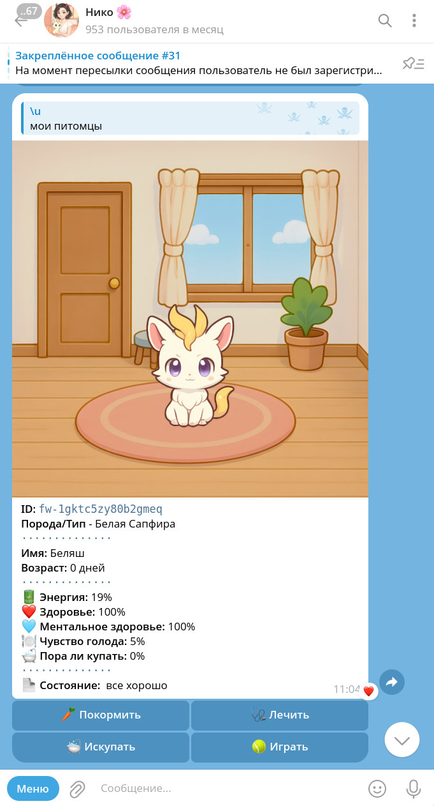

Russian | [English](README_EN.md)</br>

[](https://github.com/uriid1/tnt-tg-bot/actions/workflows/luacheck.yml)
[](LICENSE)

## Описание
tnt-tg-bot - это библиотека, написанная на Lua для платформы Tarantool, которая предоставляет интерфейсы для работы с Telegram Bot API.

> [!NOTE]
> Для production используёте последнюю из стабильных веток, или последний релиз.
> 
> В ветке `master` API может быть обновлён или быть частично совместимым с релизной версий.

## Особенности
  + Простата и ясность интерфейсов
  + Асинхронная обработка запросов
  + Встроенная поддержка работы с платежами в Telegram Stars
  + Встроенные методы для обработки команд, в том числе callback
  + Вы сами даёте названия событиям, из коробки у вас только - `bot.events.onGetUpdate(ctx)`
  + Простая работа с WebApp
  + [[TWA](https://core.telegram.org/bots/webapps)] Проверка валидности [initData](https://core.telegram.org/bots/webapps#validating-data-received-via-the-mini-app) модулем - [bot/init.lua](bot/libs/parseInitData.lua)
  + [[TWA](https://core.telegram.org/bots/webapps)] Реализованна поддержка ручек (routes)
  + Поддержка аннотаций LDoc
  + Большое колличество примеров

----
## Оглавление

1. [Showcase](#showcase)
2. [Установка](#install)
3. [Примеры](#examples)
4. [Структура](#project-structure)
5. [Интерфейсы](#interfaces)
6. [Рекомендации](#guideline)
7. [Генерация документации](#gen-doc)
----

## <a name='showcase'>Showcase</a>
- [Niko Bot](https://t.me/Niko_rp_bot) - Бот с мини играми, множеством команд, питомцами и модерацией групп
  <details>
    <summary >Открыть скриншот</summary>
    
  </details>
- [Talking Hooligan](https://t.me/talking_piska_bot) - Популярный бот для чатов, присылает смешные и глупые сообщения

## <a name='install'>Установка</a>

### Автоматическая
1. Установите `git`, `curl`, `lua 5.1` и `luarocks`.
2. (опционально) если нужна работа с WebApp: </br>
    Потребуется установить rock пакет `luaossl`, для него в вашем дистрибутиве - </br>
    установите заголовочные файлы для `lua 5.1` и `openssl`.
2. Установите [tarantool](https://www.tarantool.io/ru/download/os-installation)
3. Выполните скрипт автоматической установки необходимых пакетов
```bash
bash tnt-tg-bot.pre-build.sh
```
5. В случае проблем, перейти к ручной установки.

> [!NOTE]
> Для успешной сборки `luaossl` - биндинга к OpenSSL, потребуются заголовочные файлы OpenSSL и Lua 5.1.
> В Ubuntu можно установить, выполнив `sudo apt install libssl-dev liblua5.1-0-dev`.
> `luaossl` нужен для работы модуля `bot/libs/parseInitData.lua`, модуль нужен для обработки данных веб Mini App.
> https://core.telegram.org/bots/webapps#validating-data-received-via-the-mini-app

### Ручная
1. Установите `git`, `curl`, `lua 5.1` и `luarocks`.
2. Установите [tarantool](https://www.tarantool.io/ru/download/os-installation)
3. (опционально) если нужна работа с WebApp: </br>
    Потребуется установить rock пакет `luaossl`, для него в вашем дистрибутиве - </br>
    установите заголовочные файлы для `lua 5.1` и `openssl`.
4. Установка необходимых пакетов с помощью `luarocks`
  + **HTTP клиент/сервер (обязательно)**
    ```bash
    luarocks install --local --tree=$PWD/.rocks --server=https://rocks.tarantool.org/ http
    ```
  + **Multipart Post обработчик (обязательно)**
    ```bash
    luarocks install --local --tree=$PWD/.rocks --lua-version 5.1 lua-multipart-post 1.0-0
    ```
  + **Биндинг к openssl (опционально)**
    ```bash
    luarocks install --local --tree=$PWD/.rocks --lua-version 5.1 luaossl
    ```


## <a name='examples'>Примеры</a>
  + [Observer pattern](examples/pattern-observer) - Пример показывает реализацию паттерна наблюдателя, по факту - диспетчеризация событий. Так же пример хорошо структурирован, подходит что бы взять за основу
  + [Mini Shop](examples/mini-shop) - Пример минимального "магазина", показано как можно структурировать проект
  + [Star payments](examples/stars-payment) - Пример обработки платежей в звездах (покупка, возврат)
  + [examples/echo-bot-webhook.lua](examples/echo-bot-webhook.lua) - Эхо-бот через WebHook
  + [examples/echo-bot-old.lua](examples/echo-bot-old.lua) - Эхо-бот (старый API)
  + [examples/echo-bot.lua](examples/echo-bot.lua) - Эхо-бот (новый API) 
  + [examples/ping-pong.lua](examples/ping-pong.lua) - Реакция на команду /ping
  + [examples/send-animation.lua](examples/send-animation.lua) - Отправка gif по команде /get_animation
  + [examples/send-document.lua](examples/send-document.lua) - Отправка документа по команде /get_document
  + [examples/send-image.lua](examples/send-image.lua) - Отправка изображения по команде /get_image
  + [examples/send-image-2.lua](examples/send-image-2.lua) - Упрощенный пример отправки изображения через `bot.sendImage`
  + [examples/send-media-group.lua](examples/send-media-group.lua) - Отправка группы медиа-файлов
  + [examples/simple-callback-old.lua](examples/simple-callback-old.lua) - Пример обработки callback - /send_callback (старый API)
  + [examples/simple-callback.lua](examples/simple-callback.lua) - Упрощенный пример обработки callback команд (новый API)
  + [examples/simple-process-commands.lua](examples/simple-process-commands.lua) - Пример простого процессинга команд
  + [examples/routes-example/init.lua](examples/routes-example/init.lua) - Пример работы ручек в боте

> [!NOTE]
> Рекомендуется использовать только новый API

### Запуск примера
`BOT_TOKEN` - токен вашего бота
```bash
BOT_TOKEN="1348551682:AAFK3iZwBqEHwSrPKyi-hKyAtRgUwXrTiWW" tarantool examples/echo-bot.lua
```

## <a name='project-structure'>Структура проекта</a>
  - [bot/init.lua](bot/init.lua) - Точка входа
  - [bot/libs](bot/libs) - Вспомогательные библиотеки
  - [bot/enums](bot/enums) - Инамы
  - [bot/classes](bot/classes) - Классы для объектов телеграмма
  - [bot/middlewares](bot/middlewares) - Посредники
  - [bot/processes](bot/processes) - Процессы (like runtime). Пример processCommand - процессинг команд
  - [bot/types](bot/types) - Модели/валидаторы для типов телеграмма
  - [bot/ext](bot/ext) - Встроенные расширения (эддоны - фактически просто модули)
  - [bot/interfaces](bot/interfaces) - Интерфейсы. На текущий момент в реализации паттерн observer

## <a name='interfaces'>Интерфейсы</a>
| Метод | Описание | Пример использования |
|---------------|---------|---------------------|
| bot:cfg | Инициализация настроек | `bot:cfg { token = "123468:foobarBAZ", username = "boobar_bot" }` |
| bot.call | Выполнение запроса к Telegram API | `bot.call('sendMessage', {chat_id = 123, text = 'Привет!'})` |
| bot.events | Таблица с пользовательскими событиями | `function bot.events.onPoll(ctx) ... end` |
| bot.events.onGetUpdate | Событие обработки обновлений от Telegram | `function bot.events.onGetUpdate(ctx) ... end` |
| bot.sendImage | Упрощенная отправка картинки | `examples/send-image-2.lua`  |
| bot.Command | Минимальный обработчик команд | `bot.Command(ctx)` |
| bot.CallbackCommand | Минимальный обработчик callback команд | `bot.CallbackCommand(ctx)`
| bot:startWebHook | Запуск бота на удаленном сервере | Пример `examples/echo-bot-webhook.lua` |
| bot:startLongPolling | Запуск бота в режиме long polling | Любой пример из `examples/*` |
| bot:debugRoutes | Отладка ручек в режиме longPolling |  |

По наличию аргументов см. ldoc - `doc/index.html`

## <a name='guideline'>Рекомендации</a>

- Пользуетесь единым style guide, пример: [lua-style-guide](https://github.com/Olivine-Labs/lua-style-guide)
- Исользуйте строгий режим
```lua
-- Блокирует попытку использовать необъявленную глобальную переменную
require('strict').on()
```
- Выстраивайте единую структуру проекта

```
┌─ app.lua                       - Точка входа
├── bot                          - Библиотека tnt-tg-bot
├── pre-build.sh                 - Скрипт установки необходимых зависимостей
├── conf                         - Конфиги
├── scripts                      - Скрипты: для запуска, для линтера, ...
├── src                          - Основная директория бота
│   ├── classes                  - Классы
│   ├── enums                    - Инамы
│   ├── events                   - События для onGetUpdate
│   ├── commands                 - Разделённые по типам команды
│   │   ├── maintenance          - Директория для команд режима обслуживания
│   │   └── private              - Директория для команд, которые работают только в ЛС с ботом
│   │   └── public               - Директория для публичных команд (чаты, супергруппы, ...)
│   │   └── commandLoader.lua    - Единый загрузчик команд (команды лучше всего загружать в `bot.commands`)
│   ├── models                   - Модели для представления объектов из/в хранилище
│   ├── processes                - Процессы и рантаймы
│   │   └── processCommand.lua   - Единый обработчик команд 
│   ├── routes                   - Директория с ручками API
│   ├── services                 - Сервисы реализующие CRUD логику
│   ├── spaces                   - Схемы спейсов
│   └── utils                    - Отдельные утилиты
└── var                          - Системная директория
    ├── log                      - Директория для логов бота
    └── storage                  - Директория хранилища 
        ├── snap
        └── xlog
```

## <a name='gen-doc'>Генерация документации</a>
```bash
bash scripts/ldoc
```

## Вклад в проект
Через форк репозитория и открытия Pull Request
